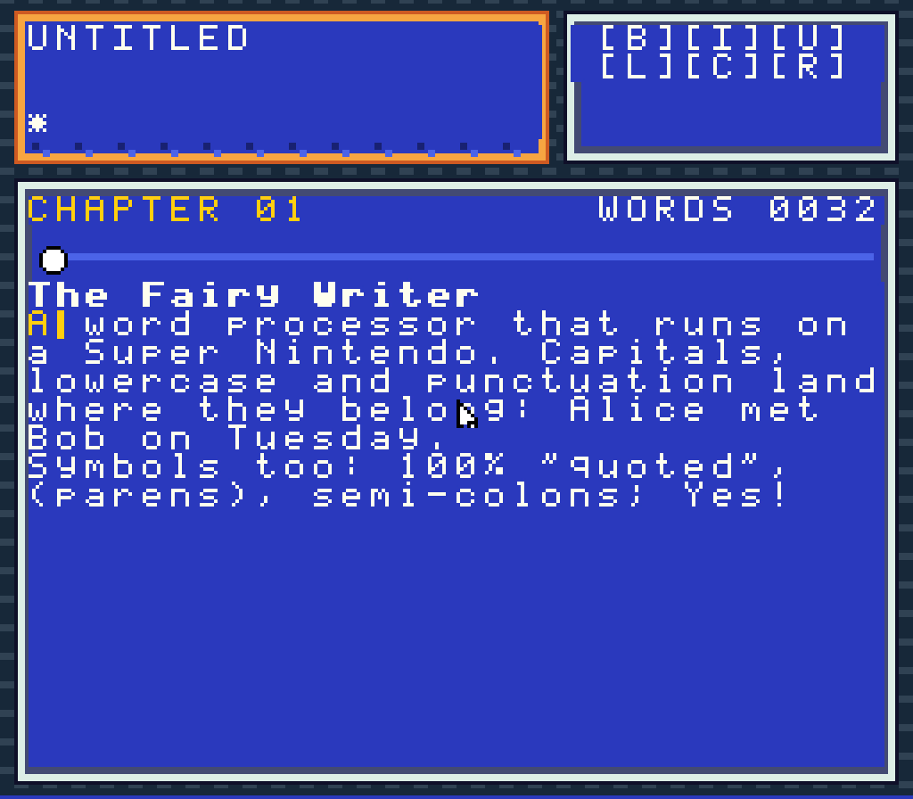

# FairyWriter

FairyWriter is an experimental word processor whose complete 256x224 interface
runs as a source-generated Super Nintendo cartridge inside a native Qt
application. The cartridge owns what you see and how input feels; the native
host owns documents, files, recovery, and operating-system integration.

The project is now open for development. It is usable enough for focused
testing, but it is not yet a stable general release. Expect missing features,
rough edges, and file-format limitations.

No commercial ROM or copyrighted game data is included. The 32 KiB FairyWriter
cartridge is generated from source during every build and embedded in the
application.

## Showcase

[](docs/media/fairywriter-showcase.webm)

Click the image to watch the one-minute, no-audio
[VP9 WebM showcase](docs/media/fairywriter-showcase.webm) of the editor in use
and its cartridge menu.

## What works today

- cartridge-owned editor, menus, file browser, help, caret, selection, toolbar,
  and document-position control;
- keyboard input through an emulated XBAND keyboard and pointer input through
  an emulated Super NES Mouse;
- native document state, undo/redo, crash recovery, recent files, and atomic
  saves;
- ODT, DOCX, RTF, HTML, and plain-text document paths inherited and adapted
  from FocusWriter;
- macOS arm64 and Linux x86_64 builds, plus Windows x64 source and packaging
  support awaiting its first physical-host acceptance pass;
- real cartridge/runtime, mailbox, document, recovery, and packaging tests.

The fixed 256x224 virtual screen and cartridge ownership of all visible UI are
product invariants, not a temporary theme.

## Build

FairyWriter needs CMake, Ninja, Go, Qt 6.8 or newer, Zlib, and a C/C++ compiler.
First prepare the pinned runtime dependency:

```sh
./scripts/bootstrap-snesrecomp.sh
```

Then configure, build, and test:

```sh
cmake -S . -B build -G Ninja -DCMAKE_BUILD_TYPE=Release -DBUILD_TESTING=ON
cmake --build build --parallel
ctest --test-dir build --output-on-failure
```

See [BUILDING.md](BUILDING.md) for platform-specific requirements and
packaging.

## How it works

The build generates a real LoROM image from `tools/fairywriter-rom`, embeds it
in the native executable, and runs it through the pinned `snesrecomp` machine
core. Commands and viewport snapshots cross a bounded SRAM mailbox:

```text
keyboard / mouse -> cartridge -> command ring -> native document engine
                                           <-> viewport snapshot buffers
screen pixels     <- cartridge <- metadata / text / format runs
```

This boundary lets the cartridge remain the authoritative user interface while
the host safely handles full documents and platform services. Read
[docs/ARCHITECTURE.md](docs/ARCHITECTURE.md) for the detailed explanation.

## Project map

- `tools/fairywriter-rom/` — deterministic 65816 cartridge generator
- `src/snes_machine.c` — embedded SNES machine boundary
- `src/mailbox.*` — bounded cartridge/host protocol
- `src/document_engine.*` — authoritative native document model
- `packaging/` — macOS, Linux, and Windows packaging gates
- `tests/` — real protocol, document, presentation, and machine regressions
- `plan.md` and `DEVELOPMENT_STATUS.md` — active roadmap and implementation
  status

## Contributing

Start with [CONTRIBUTING.md](CONTRIBUTING.md). The active engineering state is
kept in `SCRATCH.MD` so work can survive agent and developer handoffs; please
preserve and update it when making substantial changes.

Bug reports and development discussion are welcome in
[GitHub Issues](https://github.com/navjack/FairyWriter/issues).

## Development process and AI disclosure

FairyWriter was conceived and directed by Jack Mangano. The product ideas came
from Jack, with the initial spark coming from a friend who wanted a word
processor that looked like it belonged on the SNES. The decisive answer was to
build the word processor on an actual source-generated SNES cartridge.

Development made extensive use of agentic LLM coding assistance from Claude
Fable, Opus, and Sonnet; Gemini Flash and Pro; and ChatGPT 5.6 Luna, Terra, and
Sol. The agents helped implement, investigate, test, document, package, and
audit the project under human direction. Read
[How FairyWriter was developed](docs/DEVELOPMENT_PROCESS.md) for the full
history, workflow, and attribution.

## Heritage and license

FairyWriter is derived from
[FocusWriter 1.9.0](https://gottcode.org/focuswriter/). Its document and desktop
foundation is copyright Graeme Gott and contributors. See
[CREDITS.md](CREDITS.md), [THIRD_PARTY_NOTICES.md](THIRD_PARTY_NOTICES.md), and
the retained [upstream changelog](docs/UPSTREAM_CHANGELOG.md).

FairyWriter is free software under [GPL-3.0-or-later](COPYING).
